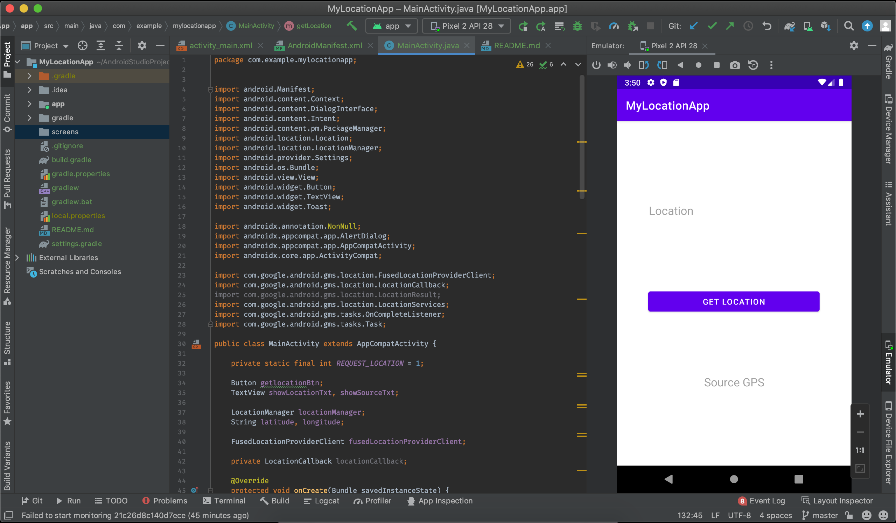
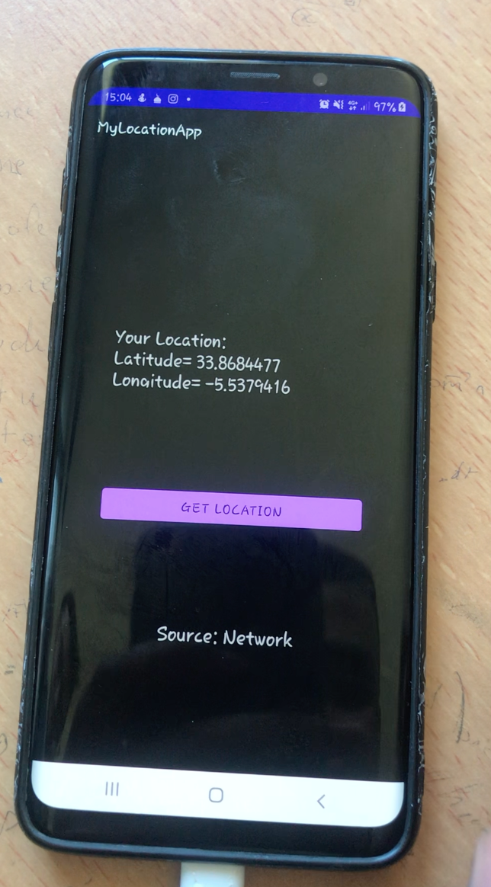
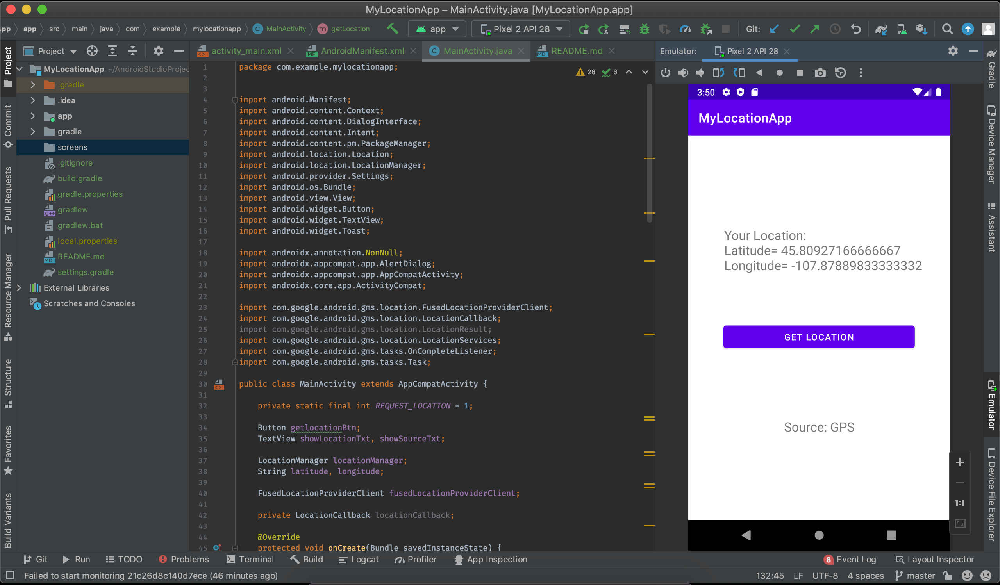

# MIAAD - Programmation d’interfaces embarquées

Encadré par : **Pr. S. BENHLIMA**  
Réaliser par : **Marwane BERIICH**  
Ce repository contient tous les TP de Module: Programmation d’interfaces embarquées  Pr. S. BENHLIMA

## 3éme TP

Ce TP nous permet d'obtenir la localisation actuel d'utilisateur.

> Fenetre 1: etat initial d'application.

> Fenetre 2: Simulation en appareil (Samsung Galaxy S9+).

> Fenetre 3: Simulation en Simulateur (Pixel 2 API 28).

Au cas où vous auriez des questions, n'hésitez pas à me contacter à [mail](mailto:marwaneberiich@gmail.com)
